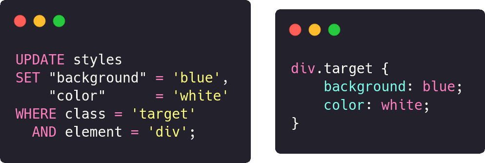

<!-- README template from https://github.com/dthung1602/sqss -->


[![Contributors][contributors-shield]][contributors-url]
[![Forks][forks-shield]][forks-url]
[![Stargazers][stars-shield]][stars-url]
[![Issues][issues-shield]][issues-url]
[![WTFPL License][license-shield]][license-url]
[![NPM][npm-shield]][npm-url]
[![TypeScript][typescript-shield]][npm-url]

<!-- PROJECT LOGO -->
<br />
<p align="center">
    
</p>


<!-- ABOUT THE PROJECT -->
## What is this?

<br />
<div align="center">
    <p>Structured Query Style Sheet</p>
    <p>Style your HTML with some good old SQL !</p>
    <a href="https://dthung1602.github.io/sqss/playground.html" target="_blank"><b>Try it in your browser!</b></a>
    <br />    
    <br />    
    • &nbsp; <a href="https://dthung1602.github.io/sqss/" target="_blank">Project homepage</a>
    &nbsp; • &nbsp;
    <a href="https://www.npmjs.com/package/@dthung1602/sqss" target="_blank">NPM Package</a>
    <br />
    <br />
    
</div>

## But why?

Why not?

After all [Cascading Server Sheets](https://dev.to/thormeier/dont-try-this-at-home-css-as-the-backend-what-3oih) is a
real thing, you know.

<p align="center">
    
    <br />
    <a href="https://www.smbc-comics.com/comic/qc" target="_blank">Sauce for 🍝</a>
</p>


<!-- GETTING STARTED -->
## Getting Started

- For all supported features, see [examples.md](https://github.com/dthung1602/sqss/blob/master/example.md) or the 
[Online Documentation](https://dthung1602.github.io/sqss/documentation.html#supported-features)

- To try SQSS in browser visit [playground page](https://dthung1602.github.io/sqss/playground.html)

- To include the transpiler on your website, add the following line:

```html
<!-- To use the latest version-->
<script src="https://unpkg.com/@dthung1602/sqss/dist/bundle/index.js" />

<!-- Or to specify a version -->
<script src="https://unpkg.com/@dthung1602/sqss@<version go here>/dist/bundle/index.js" />

<!-- `transpileSQSSToCSS` is now available in your global scope!-->
<!-- To add style to your website, use the following snippet-->
<script>
   const sqlString = `
        -- All of your styles go here
        UPDATE styles
        SET "background" = 'blue'
        WHERE class = 'target';
   `;
   
   const cssString = transpileSQSSToCSS(sqlString);
   document.head.innerHTML += `<style>${cssString}</style>`;
</script>
```

- Or you can install from `npm`:

```bash
$ npm i @dthung1602/sqss
# or yarn
$ yarn add @dthung1602/sqss
```

- To use it in your project, call the transpile function in your build script:

```js
const sqss = require("@dthung1602/sqss");
const fs = require("fs");

const sqlString = fs.readFileSync("path/to/your/stylesheet.sql", "utf-8");
const cssString = sqss.transpileSQSSToCSS(sqlString);

fs.writeFileSync("path/to/your/build/folder/output.css", cssString);
```

**TypeScript is supported**

```ts
import { transpileSQSSToCSS } from "@dthung1602/sqss";
const css: string = transpileSQSSToCSS(`UPDATE styles SET color = 'blue' where id = 'target';`);
```

<!-- LICENSE -->
## License

Distributed under the WTFPL License.

**You just DO WHAT THE F*CK YOU WANT TO**


<!-- CONTRIBUTING -->
## Contributing

Any contributions you make are greatly appreciated.

1. Fork the Project
2. Create your Feature Branch (`git checkout -b feature/AmazingFeature`)
3. Commit your Changes (`git commit -m 'Add some AmazingFeature'`)
4. Push to the Branch (`git push origin feature/AmazingFeature`)
5. Open a Pull Request


<!-- CONTACT -->
## Contact

Duong Thanh Hung - [dthung1602@gmail.com](mailto:dthung1602@gmail.com)

Project Link: [https://github.com/dthung1602/sqss](https://github.com/dthung1602/sqss)


<!-- ACKNOWLEDGEMENTS -->
## Acknowledgements
* [Cascading Server Sheets](https://dev.to/thormeier/dont-try-this-at-home-css-as-the-backend-what-3oih)
* [IaSQL](https://iasql.com/)
* [Introduction to Compilers and Language Design](https://www3.nd.edu/~dthain/compilerbook/)
* [SMBC Comics](https://www.smbc-comics.com/comic/qc)
* [Font awesome](https://fontawesome.com/icons)
* [Color hunt](https://colorhunt.co)
* [Ace editor](https://ace.c9.io/)
* [Highlight js](https://highlightjs.org/)
* [Img Shields](https://shields.io)
* [Best README template](https://github.com/othneildrew/Best-README-Template)


<!-- MARKDOWN LINKS & IMAGES -->
<!-- https://www.markdownguide.org/basic-syntax/#reference-style-links -->
[contributors-shield]: https://img.shields.io/github/contributors/dthung1602/sqss.svg?style=flat-square
[contributors-url]: https://github.com/dthung1602/sqss/graphs/contributors
[forks-shield]: https://img.shields.io/github/forks/dthung1602/sqss.svg?style=flat-square
[forks-url]: https://github.com/dthung1602/sqss/network/members
[stars-shield]: https://img.shields.io/github/stars/dthung1602/sqss.svg?style=flat-square
[stars-url]: https://github.com/dthung1602/sqss/stargazers
[issues-shield]: https://img.shields.io/github/issues/dthung1602/sqss.svg?style=flat-square
[issues-url]: https://github.com/dthung1602/sqss/issues
[license-shield]: https://img.shields.io/github/license/dthung1602/sqss.svg?style=flat-square
[license-url]: https://github.com/dthung1602/sqss/blob/master/LICENSE
[typescript-shield]: https://img.shields.io/npm/types/@dthung1602/sqss?style=flat-square
[npm-url]: https://www.npmjs.com/package/@dthung1602/sqss
[npm-shield]: https://img.shields.io/npm/v/@dthung1602/sqss?style=flat-square
